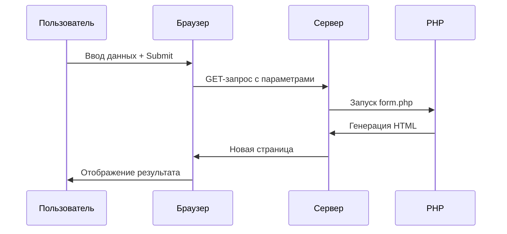

### Подробный разбор текста курса по PHP (строго по материалам автора)

#### 1. **Работа с параметрами через URL**

```php
<?php
// Проверка наличия параметра и вывод заголовка (как описано в тексте)
if (!empty($_GET['book'])) {
    echo '<h1>' . $_GET['book'] . '</h1>';
}

// Вывод всего массива GET (как указано автором)
print_r($_GET);
```

- **Добавление параметров через `?` в URL**:  
  `index.php?book=Harry+Potter`
- **Реакция скрипта**:  
  Проверка `!empty($_GET['book'])` и вывод содержимого

---

#### 2. **Создание HTML-формы с методом GET**

```html
<!-- Форма из текста курса -->
<form action="form.php" method="get">
  <input type="text" name="book" />
  <input type="submit" value="Submit" />
</form>
```

- **`action="form.php"`**: Текущий файл обработчика
- **`method="get"`**: Параметры передаются через URL
- **`name="book"`**: Ключ параметра в массиве `$_GET`
- **Результат в браузере**:  
  При вводе "Harry Potter" → URL: `form.php?book=Harry+Potter`

---

#### 3. **Автозаполнение поля после отправки**

```php
<!-- Решение из текста для repopulate поля -->
<input type="text" name="book"
       value="<?php if (!empty($_GET['book'])) echo $_GET['book']; ?>">
```

- **Проблема**: После отправки поле очищается
- **Решение автора**:  
  Проверка `!empty($_GET['book'])` и вывод значения в `value`
- **Пример работы**:
  1. Ввод "Beauty and the Beast" → Отправка
  2. Значение остается в поле для коррекции

---

#### 4. **Особенности поведения браузера (по тексту)**

- **Обычное обновление (F5)**:  
  Браузер сохраняет введенные данные, игнорируя `value`
- **Обновление через адресную строку**:  
  Браузер использует значение из атрибута `value`
- **Пример из текста**:
  ```html
  <!-- При value="Lord of the rings" -->
  <input type="text" name="book" value="Lord of the rings" />
  ```
  После отправки и обновления через URL → Показывает "Lord of the rings"

---

#### 5. **Механика обработки формы (как описано)**



- **Ключевые этапы**:
  1. Полный перезапуск PHP-скрипта
  2. Новый запрос к серверу
  3. Пересоздание страницы с новыми параметрами

---

#### 6. **Синтаксические пояснения из текста**

```php
<?php
// Однострочная проверка без {} (как объяснено)
if (!empty($_GET['book'])) echo $_GET['book'];
```

- **Почему без фигурных скобок**:  
  Для одиночных команд `{}` не обязательны
- **Альтернативный синтаксис**:  
  Не используется, так как не требуется

---

#### 7. **Ограничения и предупреждения (прямо из текста)**

1. **Безопасность вывода**:  
   Не упомянуто использование `htmlspecialchars()`
2. **Особенности repopulate**:  
   Работает только при обновлении через URL-бар

3. **Тип формы**:  
   GET-форма используется для передачи данных через URL

> Следующая тема: формы с методом POST для передачи данных без отображения в URL.
