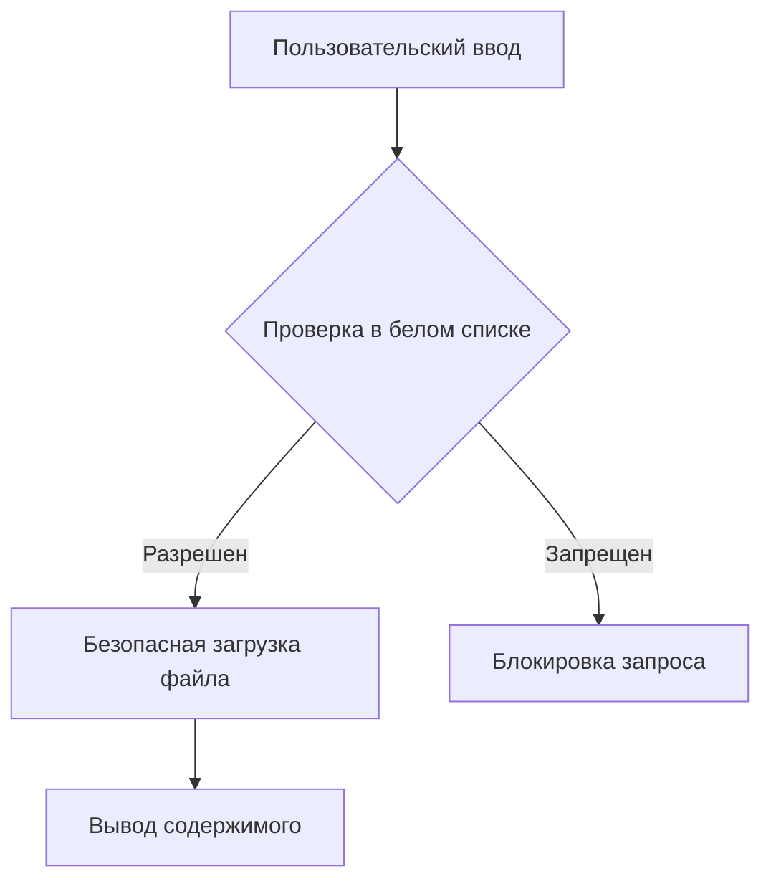

### Объяснение лекции: Уязвимости Path Traversal и защита через "белый список"

#### **1. Проблема предупреждений при начальной загрузке**

**Исходная проблема:**

```php
// Опасный код без проверки
$page = $_GET['page']; // Warning: undefined index
echo file_get_contents("pages/$page.html");
```

**Решение:**

```php
// Добавляем проверку существования параметра
if (!empty($_GET['page'])) {
    $filePath = 'pages/' . $_GET['page'] . '.html';
    echo file_get_contents($filePath);
}
```

---

#### **2. Уязвимость Path Traversal Attack**

**Суть атаки:**

```php
// Злоумышленник изменяет URL:
// include.php?page=../../secret

// Сервер пытается загрузить:
file_get_contents('pages/../../secret.html');
// Результат: /secret.html (выход за пределы папки pages)
```

**Демонстрация:**

1. Создаем файл `secret.html` вне папки `pages`
2. В URL указываем: `?page=../../secret`
3. Сервер загружает защищенный файл:
   ```html
   <!-- Содержимое secret.html -->
   Confidential information!
   ```

---

#### **3. Ошибочное решение через POST**

```php
<form method="POST"> <!-- ❌ Не защищает! -->
  <select name="page">
    <option value="citrus_salmon">Citrus Salmon</option>
  </select>
</form>
```

**Почему не работает:**

1. Пользователь может изменить HTML через DevTools:
   ```html
   <!-- Измененное значение -->
   <option value="../../secret">Hacked</option>
   ```
2. POST-данные легко модифицируются

---

#### **4. Правильное решение: "Белый список" (Allow List)**

```php
<?php
// Шаг 1: Создаем "белый список" разрешенных значений
$allowedPages = [
    'citrus_salmon',
    'mediterranean_pasta',
    'vegetable_risotto',
    'spicy_tacos'
];

// Шаг 2: Проверяем ввод
if (!empty($_GET['page']) && in_array($_GET['page'], $allowedPages)) {
    // Шаг 3: Используем проверенное значение
    $filePath = 'pages/' . $_GET['page'] . '.html';
    echo file_get_contents($filePath);
}
?>
```

**Принцип работы:**

1. Только значения из `$allowedPages` разрешены
2. `../../secret` не проходит проверку `in_array()`
3. Даже если злоумышленник изменит URL, файл не загрузится

---

#### **5. Задание на рефакторинг**

**Требуется преобразовать в ассоциативный массив:**

```php
// Исходный массив (для справки)
$allowedPages = [
    'citrus_salmon',
    'mediterranean_pasta',
    // ...
];

// Нужно преобразовать в:
$recipes = [
    'citrus_salmon' => 'Citrus Salmon',
    'mediterranean_pasta' => 'Mediterranean Pasta',
    // ...
];
```

**Цели рефакторинга:**

1. Генерация выпадающего списка через цикл
2. Централизованное управление данными
3. Упрощение добавления новых рецептов

---

#### **6. Пример реализации для задания**

```php
<?php
// Ассоциативный массив рецептов
$recipes = [
    'citrus_salmon' => 'Citrus Salmon',
    'mediterranean_pasta' => 'Mediterranean Pasta',
    'vegetable_risotto' => 'Vegetable Risotto',
    'spicy_tacos' => 'Spicy Tacos'
];

// "Белый список" для безопасности
$allowedPages = array_keys($recipes);
?>

<form method="GET">
  <select name="page">
    <option value="">Please select a recipe</option>
    <?php foreach ($recipes as $file => $name): ?>
      <option value="<?= e($file) ?>"
        <?= (!empty($_GET['page']) && $_GET['page'] === $file) ? 'selected' : '' ?>
      >
        <?= e($name) ?>
      </option>
    <?php endforeach; ?>
  </select>
  <input type="submit" value="Submit">
</form>

<?php
// Безопасная загрузка контента
if (!empty($_GET['page']) && in_array($_GET['page'], $allowedPages)) {
    $filePath = 'pages/' . $_GET['page'] . '.html';

    // Дополнительные проверки
    if (file_exists($filePath)) {
        echo file_get_contents($filePath);
    }
}
?>
```

**Ключевые улучшения:**

1. Единый источник данных (`$recipes`)
2. Автоматическая генерация `<option>`
3. Значения для формы и безопасности синхронизированы
4. Использование функции `e()` для экранирования

---

### Схема защиты



### Критические правила безопасности

1. **Всегда используйте "белые списки"**  
   Никогда не полагайтесь на "черные списки"

   ```php
   // ❌ Опасный подход
   if ($page !== 'hack') {...}

   // ✅ Правильный подход
   $allowed = ['safe1', 'safe2'];
   if (in_array($page, $allowed)) {...}
   ```

2. **Храните данные отдельно от логики**  
   Используйте массивы/объекты для централизованного управления

3. **Экранируйте все выводы**  
   Всегда используйте `e()` при выводе в HTML

4. **Проверяйте существование файлов**
   ```php
   if (file_exists($path) && is_file($path)) {
       // Действия с файлом
   }
   ```

> 🔒 **Философия безопасности**  
> "Никогда не доверяй пользовательскому вводу.  
> Все входные данные - зло, пока не доказано обратное."
